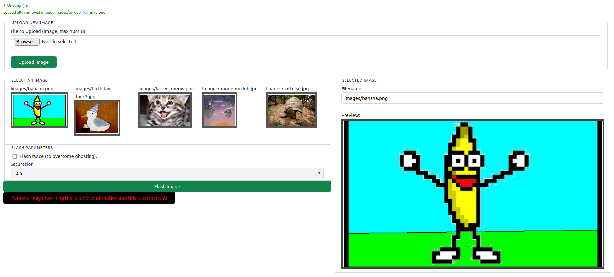
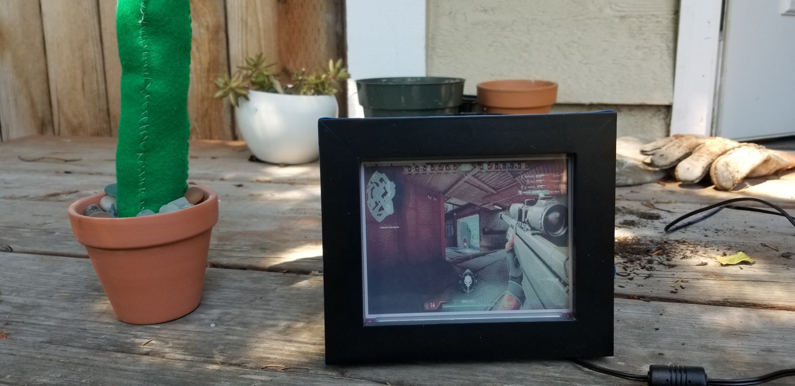

# Inky Soup

# Introduction
Inky Soup is automation for displaying images on the Pimoroni Inky Impression e-ink screen.
It provides users with a web page that they can use to flash images
to their Inky Impression.  

I suggest using a Pi Zero W, as it has low compute requirements and when combined with the e-ink display, it has very low power utilization (~1 watt peak).

## Web Page

## Example Display Build

# Instructions

The project consists of two components:

1. A web page - this component is written in Rust using the fine library Rocket
for all the web stuff.
1. A python script for flashing the images to the screen.

Use the deploy script to build and deploy to your Pi.

    INKY_SOUP_IP=<your Pi's IP or hostname> ./deploy.sh

Then, run the image server by hand:

    cd inky-soup
    ./upload-server

Or, run it as a service:

    cd inky-soup
    cp inky-soup.service /etc/systemd/system/
    sudo systemctl start inky-soup.service

Now, visit your PI in a web browser (port 8000) over your local network and start uploading
images!

# TODO

## Basic
* add validator for image types
* logging

## Image Gallery
* Hard code some limit to how many pictures can be uploaded?
* Some kind of confirmation dialog for the delete button?

## Image Rotation
* [ ] Add a way to show a random image at a fixed interval.
* [ ] Add a way to rotate images in sequential order.
* [ ] Add a way to configure the change interval.

## Advanced
* preview image before flashing? allow user to crop interactively?
